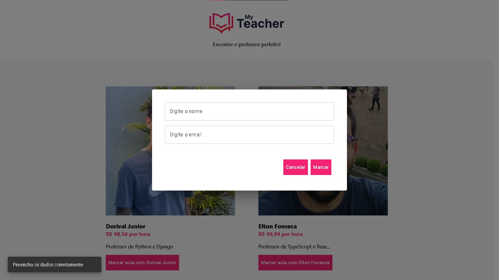

# MyTeacher
<h2>Portal para agendamentos de aulas online com um banco de dados para cadastrar e selecionar professores.</h2><br>

> Status do projeto: Em desenvolvimento


Para rodar o servidor do projeto na sua máquina, execute no terminal:

```
Set-ExecutionPolicy -Scope Process -ExecutionPolicy Bypass
```

```
"Pasta onde salvou o projeto"/server/.venv/Scripts/Activate.ps1
```
```
python .\manage.py runserver   

```
Para rodar o frontend do projeto na sua máquina, execute no terminal:
```
npm run dev
```
<div>

</div>
<div>

</div>
<div>

</div>


